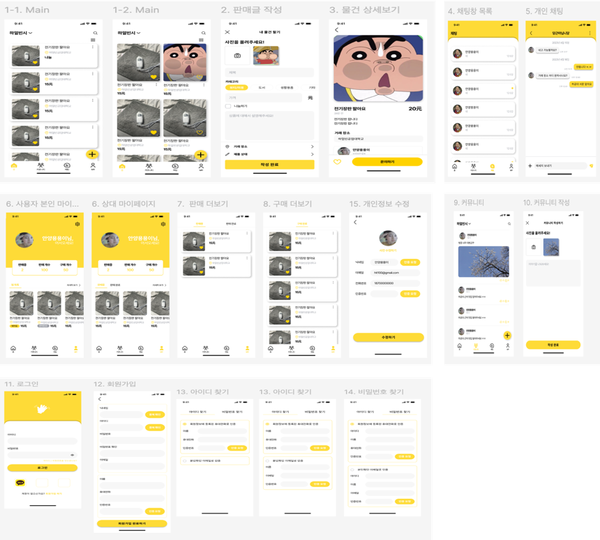
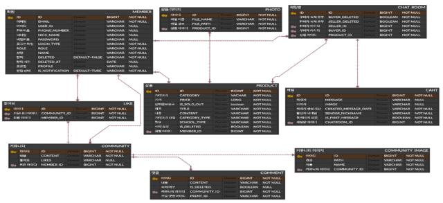
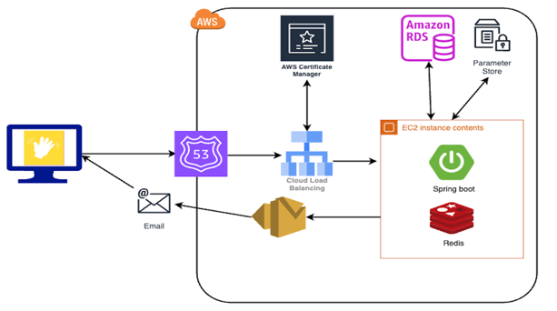

# GoodByeGood 프로젝트

중국 하얼빈 대학교의 학생들을 중심으로 한 중고마켓 애플리케이션을 개발하였습니다. 이 프로젝트는 학생들이 손쉽게 중고 물품을 거래할 수 있는 플랫폼을 제공하기 위해 시작되었습니다.

**기술 스택**

- Spring boot
- Spring Security
- Redis
- MySql
- React Native
- Aws Ec2
- Aws RDS
- Aws Parameter Store
- AWS S3
- AWS SES

## 디자인

## ERD

## 시스템 아키텍처

